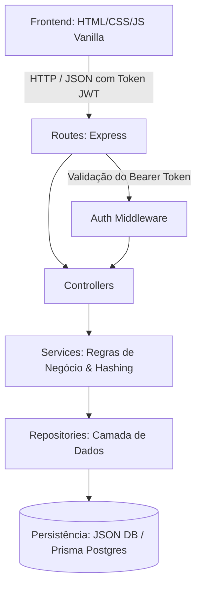

# 🚨 Bairro Alerta — Rede Comunitária de Alertas de Desastres Climáticos

> **Projeto desenvolvido para Hackathon com foco em impacto social, sustentabilidade e resiliência climática.**  
> Uma plataforma colaborativa e hiperlocal para emissão e visualização de alertas sobre eventos climáticos extremos (enchentes, deslizamentos, vendavais, calor extremo e tempestades provocadas por anomalias climáticas como o *Super El Niño*).

---

## 📌 Sumário
- [💡 Sobre o Projeto](#-sobre-o-projeto)
- [🎯 O Problema & A Solução](#-o-problema--a-solução)
- [✨ Funcionalidades](#-funcionalidades)
- [🛠️ Tecnologias Utilizadas](#️-tecnologias-utilizadas)
- [📂 Estrutura de Pastas](#-estrutura-de-pastas)
- [🏛️ Arquitetura do Sistema](#️-arquitetura-do-sistema)
- [🔌 Endpoints da API (REST)](#-endpoints-da-api-rest)
- [🚀 Como Executar o Projeto](#-como-executar-o-projeto)
  - [Pré-requisitos](#pré-requisitos)
  - [1. Backend](#1-execução-do-backend)
  - [2. Frontend](#2-execução-do-frontend)
- [🗺️ Próximos Passos](#️-próximos-passos)
- [👥 Equipe](#-equipe)

---

## 💡 Sobre o Projeto

Com o aumento na frequência e intensidade de eventos climáticos severos decorrentes do aquecimento global, comunidades locais frequentemente sofrem com a falta de comunicação imediata e hiperlocal. 

O **Bairro Alerta** é uma solução ágil e de resposta rápida: uma aplicação web onde os próprios cidadãos e voluntários reportam ocorrências em tempo real, informando localização, tipo de desastre, raio estimado de perigo, gravidade e ponto visual no mapa, permitindo que a vizinhança tome medidas de proteção e evacuação com antecedência.

---

## 🎯 O Problema & A Solução

* **O Problema:** Avisos oficiais da Defesa Civil nem sempre chegam a tempo ou com o nível de detalhe de uma rua/bairro específico que está alagando naquele exato minuto.
* **A Solução:** Um mural colaborativo e mapa interativo em tempo real onde qualquer morador cadastrado pode registrar um alerta com severidade e coordenadas, salvando vidas e patrimônios.

---

## ✨ Funcionalidades

1. **Autenticação Segura:**
   - Cadastro e Login de moradores/voluntários.
   - Proteção de senhas com hash criptográfico (`bcrypt`).
   - Autenticação stateless via JSON Web Token (`JWT`).

2. **Mapa Interativo & Feed de Alertas:**
   - Visualização dos alertas recentes em cards detalhados.
   - Pinos interativos posicionados no mapa com código de cores por gravidade (*Baixa*, *Média*, *Alta*, *Crítica*).
   - Filtros em tempo real por tipo de desastre e severidade.
   - Modal de detalhes completos ao clicar no alerta ou no pino.

3. **Emissão de Alertas Colaborativos:**
   - Seleção do ponto exato no mapa interativo (`mapX` e `mapY`).
   - Definição do tipo do desastre (Enchente, Alagamento, Deslizamento, Vendaval, Incêndio, etc.).
   - Raio estimado de impacto (em km), nível de gravidade e descrição detalhada.

4. **Guia de Orientações Preventivas e Emergenciais:**
   - Página exclusiva com orientações de segurança e números de emergência (Defesa Civil 199, Bombeiros 193, SAMU 192).

---

## 🛠️ Tecnologias Utilizadas

### **Frontend** (100% Vanilla — Leve, performático e sem dependências pesadas)
- **HTML5:** Estrutura semântica e acessível.
- **CSS3:** Estilização moderna com variáveis CSS, responsividade mobile-first e temas de perigo/alerta.
- **JavaScript (ES6+):** Manipulação de DOM, renderização de pinos no mapa e consumo assíncrono via `fetch`.

### **Backend** (Robusto, tipado e escalável)
- **Node.js** com **TypeScript**
- **Express:** Servidor e roteamento da API REST.
- **Persistência Híbrida / Ágil:**
  - Suporte a persistência em arquivo JSON local (`backend/data/db.json`) com gravação atômica (permite rodar imediatamente sem necessidade de configurar bancos externos).
  - Suporte a **PostgreSQL** com **Prisma ORM** (modelagem e migrations prontas em `prisma/schema.prisma`).
- **JWT (jsonwebtoken):** Proteção de rotas autenticadas.
- **Bcrypt:** Criptografia de senhas.
- **CORS & Dotenv:** Segurança e parametrização por variáveis de ambiente.

---

## 📂 Estrutura de Pastas

```text
bairroAlerta/
│
├── backend/
│   ├── data/
│   │   └── db.json                   # Banco de dados local em JSON (dados persistidos)
│   ├── prisma/
│   │   └── schema.prisma             # Modelagem relacional para PostgreSQL / Prisma
│   ├── src/
│   │   ├── @types/                   # Extensão dos tipos Express (ex: req.userId)
│   │   ├── config/
│   │   │   └── jsonDatabase.ts       # Gerenciador de persistência local atômica
│   │   ├── controllers/              # Camada de controle e validação de requisições HTTP
│   │   │   ├── authController.ts
│   │   │   └── alertController.ts
│   │   ├── services/                 # Regras de negócio
│   │   │   ├── authService.ts
│   │   │   └── alertService.ts
│   │   ├── repositories/             # Camada de acesso a dados
│   │   │   ├── userRepository.ts
│   │   │   └── alertRepository.ts
│   │   ├── routes/                   # Definição dos endpoints REST
│   │   │   ├── authRoutes.ts
│   │   │   ├── alertRoutes.ts
│   │   │   └── index.ts
│   │   ├── middlewares/              # Interceptadores (authMiddleware para JWT)
│   │   │   └── authMiddleware.ts
│   │   ├── app.ts                    # Configuração dos middlewares do Express
│   │   └── server.ts                 # Inicialização do servidor HTTP
│   ├── .env                          # Variáveis de ambiente locais
│   ├── .env.example
│   ├── tsconfig.json
│   └── package.json
│
├── frontend/
│   ├── api/
│   │   └── api.js                    # Cliente de integração com o Backend (Fetch API + Token)
│   ├── assets/                       # Ícones e mapas ilustrativos
│   ├── pages/                        # Páginas secundárias
│   │   ├── login.html                # Tela de Login
│   │   ├── cadastro.html             # Tela de Cadastro de Usuário
│   │   ├── criar-alerta.html         # Formulário com seleção de ponto no mapa
│   │   └── orientacoes.html          # Guia de procedimentos preventivos e de emergência
│   ├── scripts/                      # Lógica do cliente
│   │   ├── alerts.js                 # Listagem de alertas, filtros e pinos no mapa
│   │   ├── create-alert.js           # Criação de alerta com clique no mapa
│   │   ├── guidance.js               # Interações do guia de orientações
│   │   ├── guidance-data.js          # Base de conhecimento de emergência
│   │   ├── login.js                  # Lógica de login e armazenamento de sessão
│   │   └── register.js               # Lógica de cadastro
│   ├── styles/                       # Folhas de estilo modularizadas
│   │   ├── global.css
│   │   ├── alerts.css
│   │   ├── auth.css
│   │   ├── create-alert.css
│   │   └── guidance.css
│   └── index.html                    # Página Principal (Mural + Mapa Interativo)
│
├── docs/                             # Documentação técnica e planos de integração
│   ├── api_endpoints.md
│   ├── plano_integracao_frontend_backend.md
│   └── plano_de_implementacao_mapa_backend.md
│
└── README.md                         # Documentação geral do projeto
```

---

## 🏛️ Arquitetura do Sistema

O backend adota o padrão em camadas (**Layered Architecture**), desacoplando rotas, lógica de negócio e persistência:



---

## 🔌 Endpoints da API (REST)

A API responde por padrão no prefixo `/api`.

### 1. Autenticação (`/api/auth`)
| Método | Endpoint | Protegido | Descrição | Payload (Body) |
| :--- | :--- | :---: | :--- | :--- |
| `POST` | `/api/auth/register` | ❌ | Cadastra um novo morador | `{ "name": "Maria", "email": "maria@email.com", "password": "senha" }` |
| `POST` | `/api/auth/login` | ❌ | Autentica e retorna JWT | `{ "email": "maria@email.com", "password": "senha" }` |

### 2. Alertas Comunitários (`/api/alerts`)
| Método | Endpoint | Protegido | Descrição | Exemplo de Retorno / Payload |
| :--- | :--- | :---: | :--- | :--- |
| `GET` | `/api/alerts` | ❌ | Lista todos os alertas em ordem decrescente | Array com alertas, autor, severidade e coordenadas `mapX`/`mapY` |
| `GET` | `/api/alerts/:id` | ❌ | Retorna os detalhes de um alerta específico | Objeto completo do alerta e informações do autor |
| `POST` | `/api/alerts` | ✅ | Registra novo alerta comunitário | `{ "title": "Rua Alagada", "type": "ENCHENTE", "description": "Água subindo rápido", "location": "Rua das Flores", "radiusKm": 1.5, "severity": "ALTA", "mapX": 45.2, "mapY": 60.1 }` |

### 3. Diagnóstico
| Método | Endpoint | Protegido | Descrição | Retorno |
| :--- | :--- | :---: | :--- | :--- |
| `GET` | `/health` | ❌ | Healthcheck do serviço | `{ "status": "OK", "message": "Backend is running" }` |

---

## 🚀 Como Executar o Projeto

### Pré-requisitos
- [Node.js](https://nodejs.org/) (versão 18 ou superior)
- Navegador moderno (Chrome, Firefox, Edge, Safari)

---

### 1. Execução do Backend

1. Abra o terminal na pasta `backend`:
   ```bash
   cd backend
   ```

2. Instale as dependências:
   ```bash
   npm install
   ```

3. Crie ou configure seu arquivo `.env` (já existe um pré-configurado):
   ```env
   PORT=3333
   JWT_SECRET="bairroAlertaSenhaSuperSegura"
   ```

4. Inicie o servidor de desenvolvimento:
   ```bash
   npm run dev
   ```

> 💡 **Nota sobre o Banco de Dados:** O sistema utiliza automaticamente a persistência em JSON (`backend/data/db.json`), portanto você **não precisa instalar nem configurar nenhum banco externo** para testar imediatamente. Se desejar usar PostgreSQL com Prisma, as configurações e migrações permanecem disponíveis na pasta `prisma/`.

O servidor estará ativo em: **`http://localhost:3333`**

---

### 2. Execução do Frontend

O frontend é 100% Vanilla (HTML, CSS e JavaScript) e já está integrado à API (`USE_MOCK = false` em `frontend/api/api.js`).

1. Acesse a pasta `frontend`:
   ```bash
   cd ../frontend
   ```

2. Execute através de um servidor web local ou extensão:
   - **Opção A (VS Code):** Clique com o botão direito em `index.html` e selecione **"Open with Live Server"**.
   - **Opção B (Node / npx):**
     ```bash
     npx serve .
     ```
   - **Opção C:** Abra diretamente o arquivo `frontend/index.html` no seu navegador.

---

## 🗺️ Próximos Passos

- [ ] **Geolocalização por GPS / Leaflet:** Integração com mapas reais via OpenStreetMap/Mapbox.
- [ ] **Notificações Push / WhatsApp:** Alertas automáticos via Webhook/Twilio para moradores da região delimitada.
- [ ] **Confirmação Comunitária ("Ainda está ocorrendo?"):** Votação para encerramento automático de alertas normalizados.
- [ ] **Integração com CEMADEN e Defesa Civil:** Importação automática de alertas meteorológicos governamentais.

---

## 👥 Equipe
Projeto concebido e prototipado com foco em **resiliência comunitária, agilidade de resposta e impacto social diante de eventos climáticos extremos**.
